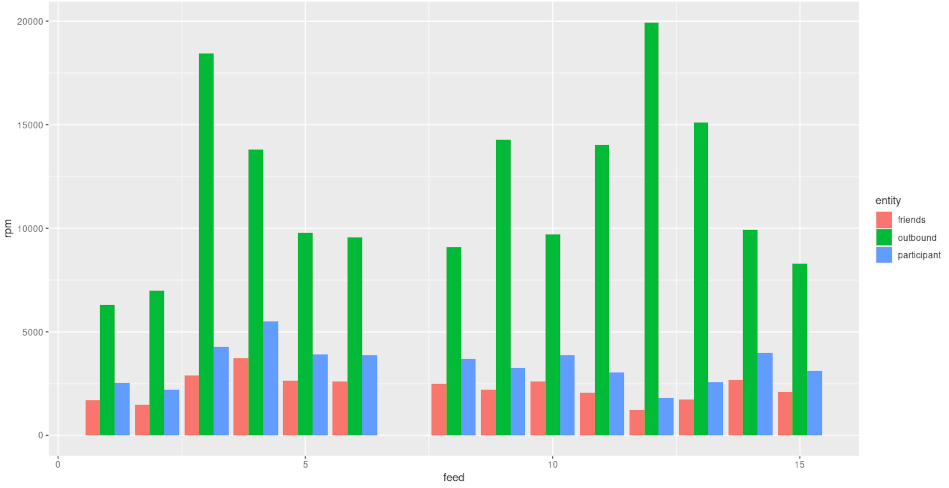
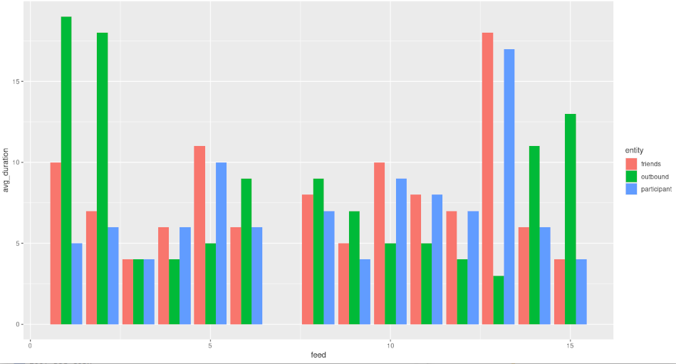
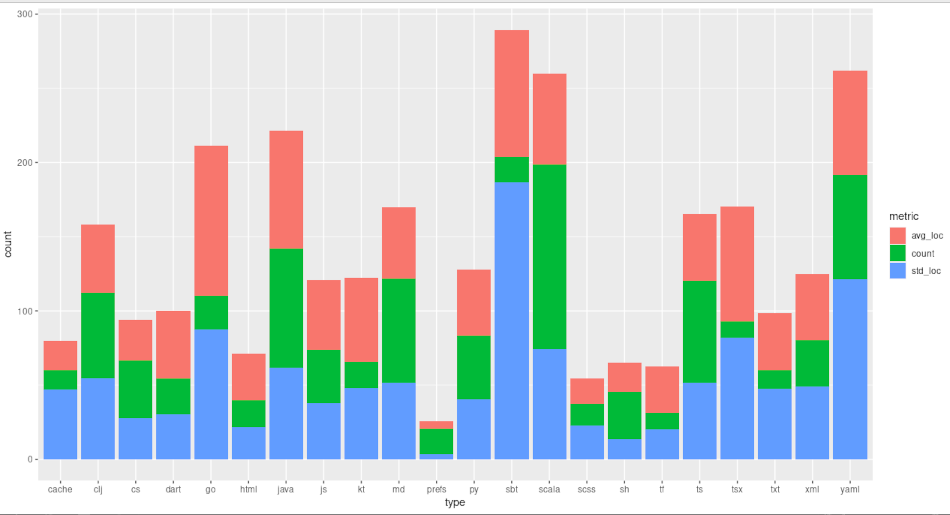

# news feed microservices

Part of what I do as a Software Architect is to evaluate and recommend various technologies as they relate to microservice development. Just reading other blogs or vendor originated marketing collateral is not sufficient. 

When I decide to learn more about a particular technology or programming language, I use it to build a rudimentary news feed microservice. I document the developer experience. I subject it to various load tests whose performance is measured. Finally, I collect those measurements and analyze them. Since each news feed implementation has feature parity, I can blog about how the technology under evaluation compares to the other technologies previously implemented here.

## by the numbers

Here is a graphical summary of the average Requests Per Minute throughput, broken down by implementation, for creating the different entities that occur during the load test run in GKE.



Here is the average duration in milliseconds of that same load.



This repo currently has the source for about two dozen buildable artifacts using 52 different file types. This chart shows the number of files for the top half most used types, their average lines of code per file with the standard deviation.



All of the code written in these evaluations is open source and is available here in this repository. This code is intended to serve in an educational capacity only. This is not production quality code. As of the time of this writing, there are 16 high severity vulnerabilities identified by dependabot and the MySql password appears in the code in plain text 33 times. The resulting build artifacts have not been evaluated in a production level environment. Here is how it is organized.

## server

These components are expected to be run on the server(s).

### feed 15 (Kotlin on Spring Web-Flux)

news feed microservice written in Kotlin on the Spring Web-Flux reactive framework.

### feed 14 (CSharp on ASP.NET)

news feed microservice written in C# on the modern post-Balmer DotNet framework.

### feed 13 (Clojure on Donkey)

news feed microservice in Clojure on Donkey which uses the Vert.x server backend

https://glennengstrand.info/software/architecture/microservice/clojure/vertx

### feed 12 (Scala on Play)

news feed microservice in Scala on the Play framework by LightBend

https://glennengstrand.info/software/architecture/microservice/vertx/play

### feed 11 (Scala on Vert.x)

news feed microservice in Scala on Vert.x using the embedded message bus

https://glennengstrand.info/software/architecture/microservice/vertx/play

### feed 10 (TypeScript on Apollo)

News feed microservice implemented in TypeScript and GraphQL

https://glennengstrand.info/software/architecture/microservice/graphql

### feed 9 (Go on Mux)

News feed microservice implemented in golang.

https://glennengstrand.info/software/architecture/microservice/golang

### feed 8 (Java on Spring Framework)

News feed microservice implemented in Java with Spring Boot

https://glennengstrand.info/software/performance/springboot/dropwizard

### feed 7 (JavaScript on Hyperledger Composer)

Source code behind this InfoQ article

https://www.infoq.com/articles/evaluating-hyperledger-composer

### feed 6 (Scala on Scalatra)

This time, the scala microservice was rewritten in an attempt to lower complexity and improve performance.

https://glennengstrand.info/software/architecture/scala/rewrite

### feed 5 (Python on Flask)

This time, the news feed microservice is implemented in Python running on Flask.

https://glennengstrand.info/software/performance/nodejs/python

### feed 4 (JavaScript on Express)

For something completely different, I blogged about a news feed microservice implementation in Node.js and how it compared with the DropWizard version.

https://glennengstrand.info/software/performance/nodejs/dropwizard

### feed 3 (Java on Dropwizard)

I returned back to Java and blogged about how the DropWizard version compared to the Clojure version of the news feed.

https://glennengstrand.info/software/performance/clojure/dropwizard

### feed 2 (Scala on Finatra)

Scala originally gained recognition with the big data community through the Apache Spark project which is basically perceived as a faster form of map reduce. Its creator, Martin Odersky, advocated that Scala demonstrates that you can have object orientation on equal footing with functional programming. I covered the Scala implementation and how it was different from the Clojure version in terms of code.

https://glennengstrand.info/software/architecture/oss/scala

I blogged about the performance differences.

https://glennengstrand.info/software/performance/scala/clojure

I blogged about how this microservice performs when running with MySql, with PostGreSql, and with Docker.

https://glennengstrand.info/software/performance/mysql/postgres/docker

I documented my research into how this microservice performed when integrated with ElasticSearch and with Solr for keyword based search.

https://glennengstrand.info/software/performance/elasticsearch/solr

### feed (Clojure on Ring)

When I started this repo, a big trend had started in Java to use new programming languages, designed to run in the Java Virtual Machine, that support Functional Programming concepts. Clojure is a variant of Lisp that is one of the leaders in this trend. The question that I wanted to answer was this. Is Clojure ready for delivering services at web scale? This folder contains a basic news feed web service written in Clojure that I blogged about there.

https://glennengstrand.info/software/architecture/oss/clojure

### solr

The supporting directory structure and configuration files needed to augment an instance of Solr to support keyword search capability for the news feed on outbound activity.

### support

This Java project builds a library used by the feed service for Solr integration and for publishing custom JMX performance metrics.

### swagger

Swagger templates and assets used to generate the api and resource classes for all feed services version 3 or greater.

### aws

This folder contains assets for standing up the service, and its dependencies, on Amazon Web Services, Google Compute Engine, and Windows Azure.

### k8s

This folder contains assets for standing up the service, and its dependencies, in Kubernetes.

https://glennengstrand.info/software/performance/eks/gke

### helm

This folder contains a helm chart that allows you to launch a news feed microservice, and the components and databases that it depends on, with a single command.

```bash
cd server/helm
helm install feed .
```

See this blog on Devops Renaissance for more information.

https://glennengstrand.info/software/architecture/devops/renaissance

### tf

Assets for provisioning a Kubernetes cluster in the various public clouds using Terraform. See this blog on Devops Renaissance for more information.

https://glennengstrand.info/software/architecture/devops/renaissance

### proxy

An API gateway, written in golang, that proxies requests from the load test app to the news feed service under test and sends performance data to the perf4 service.

### edge

An API gateway, written in golang, that proxies requests from the Nginx hosted web app to the news feed service. It handles such web client specific concerns as authentication, authorization, web streaming, and read access via GraphQL.

### prometheus

The proxy service has been enhanced to be able to make performance data available to prometheus.

### analysis

This folder contains various assets used to analyze the performance data and generate the various graphs near the top of this README.

## client

These applications are expected to be run on the client(s).

### load

This Clojure application is what I used to load test the feed web service on public clouds.

### offline analysis

These applications run offline in order to aggregate raw kafka data into per minute summary data.

#### NewsFeedPerformance

This Java project builds a Hadoop map reduce job that inputs the Kafka feed topic performance data and outputs a per minute summary of various metrics used to load the OLAP cube.

#### perf

The same map reduce job as NewsFeedPerformance only this time written in Clojure for Cascalog.

#### etl

This Clojure project takes the output from the Hadoop news feed performance map reduce job and loads a MySql database ready for use by Mondrian's Pentaho OLAP server.

#### perf2

The same map reduce job as NewsFeedPerformance only this time written in Scala for Apache Spark.

### perf3

Instead of a map reduce job, the news feed performance data is consumed from kafka where it is aggregated once a minute and sent to elastic search.

### perf4

A microservice written in Java with the vert.x framework. It is intended to be called by kong. It aggregates performance data then sends it to elastic search in batches. It does not require kafka.

### perf5

A CLI tool that queries either elastic search or solr performance statistics and writes out per time period metrics to the console.

### react

A single page web application for the news feed service written in Typescript on React.

https://glennengstrand.info/software/architecture/ionic/react/flutter

### mobile/feed

A cross OS mobile platform GUI for the news feed microservice that uses the Ionic Framework.

https://glennengstrand.info/software/architecture/ionic/react/flutter

### flutter

A cross OS platform GUI for the news feed microservice written in Flutter.

https://glennengstrand.info/software/architecture/ionic/react/flutter

### ml

Scripts used to analyze microservice performance data with machine learning algo.

https://glennengstrand.info/software/architecture/msa/ml

https://glennengstrand.info/software/architecture/ml/oss

## License

Copyright © 2013 - 2024 Glenn Engstrand

Distributed under the Eclipse Public License

https://www.eclipse.org/legal/epl-v10.html
