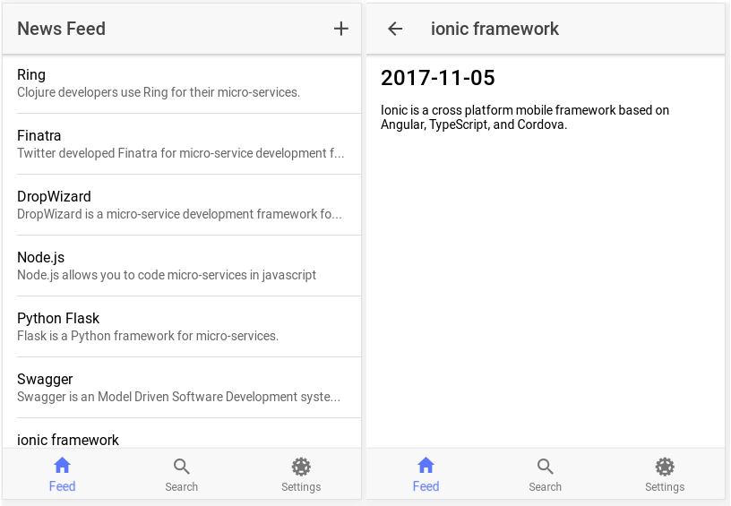

# Mobile Feed Client 🎮

I started this repo three years ago and have yet to have provided a GUI for the news feed micro-service. It was time to rectify that. 



Here you will find a project for a mobile client that is based on the [Ionic Framework](https://ionicframework.com/). I started with the [ionic-super-starter](https://github.com/ionic-team/ionic-starter-super) template and combined it with the output from the swagger-codegen module for typescript-angular2 when run with the swagger yaml specification for the news feed (used in feeds 3 through 5).

_Note: the Ionic Super Starter requires Ionic CLI 3._


Like most popular modern open source projects, Ionic is layered on top of other quality open source projects. 

* [Angular2](https://angular.io/)
* [TypeScript](https://www.typescriptlang.org/)
* [webpack](https://webpack.js.org/)
* [Apache Cordova](https://cordova.apache.org/)

One of the big advances in Ionic was moving from a rigid route-based navigation system to a flexible push/pop navigation system modeled off common native SDKs. We've embraced this pattern to provide a set of reusable pages that can be navigated to anywhere in the app. Take a look at the [Settings page](https://github.com/ionic-team/ionic-starter-super/blob/master/src/pages/settings/settings.html#L38) for a cool example of a page navigating to itself to provide a different UI without duplicating code.

## Table of Contents

1. [Getting Started](#getting-started)
2. [Pages](#pages)
3. [Providers](#providers)
4. [i18n](#i18n) (adding languages)

## <a name="getting-started"></a>Getting Started

Be advised that this project no longer can be built with modern versions of node due to a [node-sass incompatibility](https://stackoverflow.com/questions/48298361/npm-install-failed-at-the-node-sass4-5-0-postinstall-script).

```bash
npm install -g cordova ionic
cd clojure-news-feed/client/mobile/feed
vi src/providers/variables.ts
# edit the BASE_PATH value to point to where your news feed micro-service is listening
ionic serve
```
### Navigating Around in the GUI

Here is how to get started with this GUI

* When logging in, just type 2 in the email field then click sign in.
* You will see the news feed items that you created with that curl script.
* Click the plus sign to create your own news feed item
* Items you create will not appear in your own news feed
* Click the item to see the detail view.
* Click the search tab and search for Kubernetes
* Click the result to see the participant

## Pages

This application is currently composed of the following pages.

* content - provides more explanation of this project
* inbound-detail - shown when you click on a feed item from the master list
* list-master - you land here after logging in which shows your news feed items
* login - the page used to log in
* menu - responsible for the menu GUI
* outbound-create - modal dialog for creating a news feed item
* participant-detail - shown when you click on a search result
* search - used for keyword search of news feed items
* settings - vestigial part of the super template that I did not remove
* signup - vestigial part of the super template that I did not remove
* tabs - navigation bar at the bottom
* tutorial - initial experience when you launch the app
* welcome - vestigial part of the super template that I did not remove

## Providers

The Super Starter comes with some basic implementations of common providers which I have combined with the providers generated by swagger.

### User

The `User` provider is where the participant id for the current user is accessed.

### Api

The `Api` provider is a simple CRUD frontend to an API. Simply put the root of your API url in the Api class and call get/post/put/patch/delete 

## i18n

Ionic Super Starter comes with internationalization (i18n) out of the box with [ngx-translate](https://github.com/ngx-translate/core). This makes it easy to change the text used in the app by modifying only one file. 

## ParticipantApi

Swagger generated CRUD API for participants

## FriendApi

Swagger generated CRUD API for friends

## InboundApi

Swagger generated CRUD API for inbound (news feed items from your friends).

## OutboundApi

Swagger generated CRUD API for outbound (your news feed items to your friends).

### Adding Languages

To add new languages, add new files to the `src/assets/i18n` directory, following the pattern of LANGCODE.json where LANGCODE is the language/locale code (ex: en/gb/de/es/etc.).

### Changing the Language

To change the language of the app, edit `src/app/app.component.ts` and modify `translate.use('en')` to use the LANGCODE from `src/assets/i18n/`
