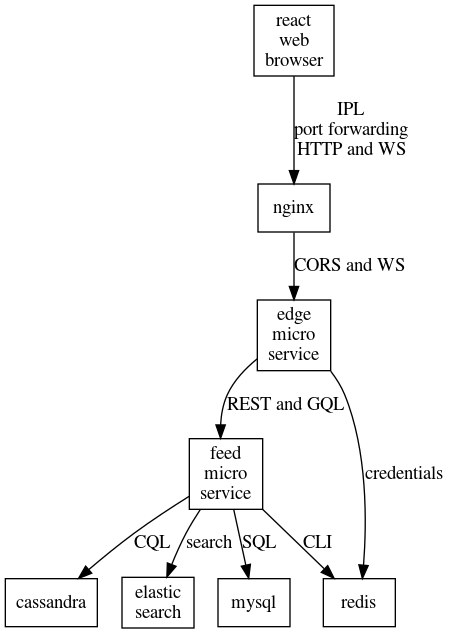

# React News Feed App

This folder contains the code for a single page web app written in Typescript on the React framework.

https://glennengstrand.info/software/architecture/ionic/react/flutter

Requests to the news feed service need to be proxied to another service called edge. I currently dev using [Kubernetes in Docker](https://kind.sigs.k8s.io/) which explains the kind command. You won't need that command if you are using something else. Once the app has launched, you will be prompted to log in. Specifying a new user name and password will automatically create a new participant and log you in as that participant. After you click the Allow button, the browser will load this app. 

## Deving Locally

The only thing that doesn't work in this configuration is the web socket that automatically syncs inbound.

```bash
cd ../../server/edge
docker build -t edge:1.0 .
kind load docker-image edge:1.0
cd ../k8s
kubectl create -f edge-service.yaml
kubectl create -f edge-deployment.yaml
kubectl port-forward deployment/edge 8080:8080 &
cd ../../client/react
npm install
npm test
npm start
```

Your web browser should open http://127.0.0.1:3000/ automatically.

## Deving in Kubernetes

The generated assets are hosted with Nginx. XHR and WS calls from the web browser get proxied through the same Nginx service to the edge service which, in turn, proxy requests to the feed service.



You have to manually change the port in the code here from 3000 to 8080. 

1. for the HOST in client/react/src/features/types.d.ts 
2. for edge.Domainvar in server/edge/server.go 
3. for the redirect_uri in server/edge/static/auth.html

Here is how to set up this app for deving in Kubernetes. If you just want to
try it out with minimal effort, then set the gui switch to true in the ../../server/helm/values.yaml file then install the feed helm chart.

```bash
cd ../../server/edge
docker build -t edge:1.0 .
kind load docker-image edge:1.0
cd ../k8s
kubectl create -f edge-service.yaml
kubectl create -f edge-deployment.yaml
cd ../../client/react
npm install
npm test
npm run build
docker build -t react:1.0 .
kind load docker-image react:1.0
cd ../../server/k8s
kubectl create -f react-service.yaml
kubectl create -f react-deployment.yaml
kubectl port-forward deployment/react 8080:8080
```

Point your web browser to http://127.0.0.1:8080/ 

## Learn More

This project was bootstrapped with [Create React App](https://github.com/facebook/create-react-app), using the [Redux](https://redux.js.org/) and [Redux Toolkit](https://redux-toolkit.js.org/) template.

You can learn more in the [Create React App documentation](https://facebook.github.io/create-react-app/docs/getting-started).

To learn React, check out the [React documentation](https://reactjs.org/).
