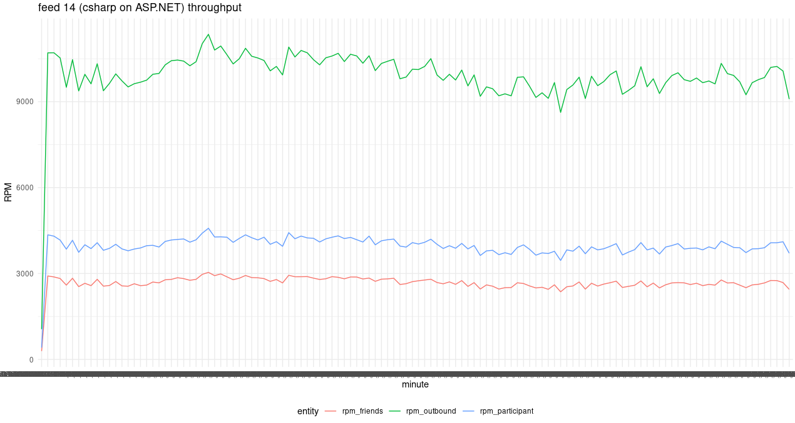

# news feed in C# on ASP.NET

local dev setup

```bash
cd service
dotnet add package MySql.Data --version 8.1.0
dotnet add package NRedisStack
dotnet add package CassandraCSharpDriver --version 3.19.3
cd ../tests
dotnet add package moq
```

deving locally

```bash
cd service
dotnet build
cd ../tests
dotnet test
cd ../service
dotnet run
```

This graph shows the RPM of the create requests of the various entities during the load test on GKE.



