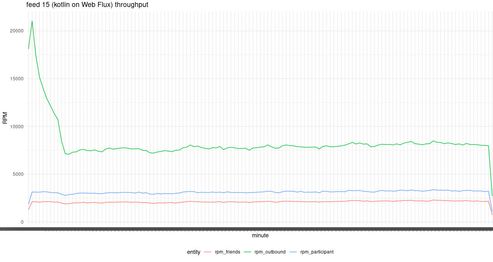
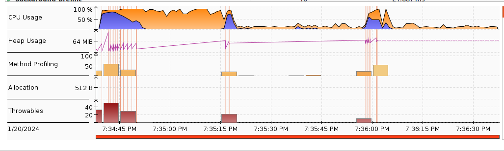

# news feed written in Kotlin on Spring Web-Flux

The dockerfile is multi-stage which both builds the uber jar and runs it.

```
docker build -t feed15:1.0 .
```

This graph shows the RPM of the create requests of the various entities during the load test on GKE.



Here is a screenshot from JDK Mission Control displaying a Java Flight Recorder session of feed 15 when run locally under the Gatling load test from feed 12.



