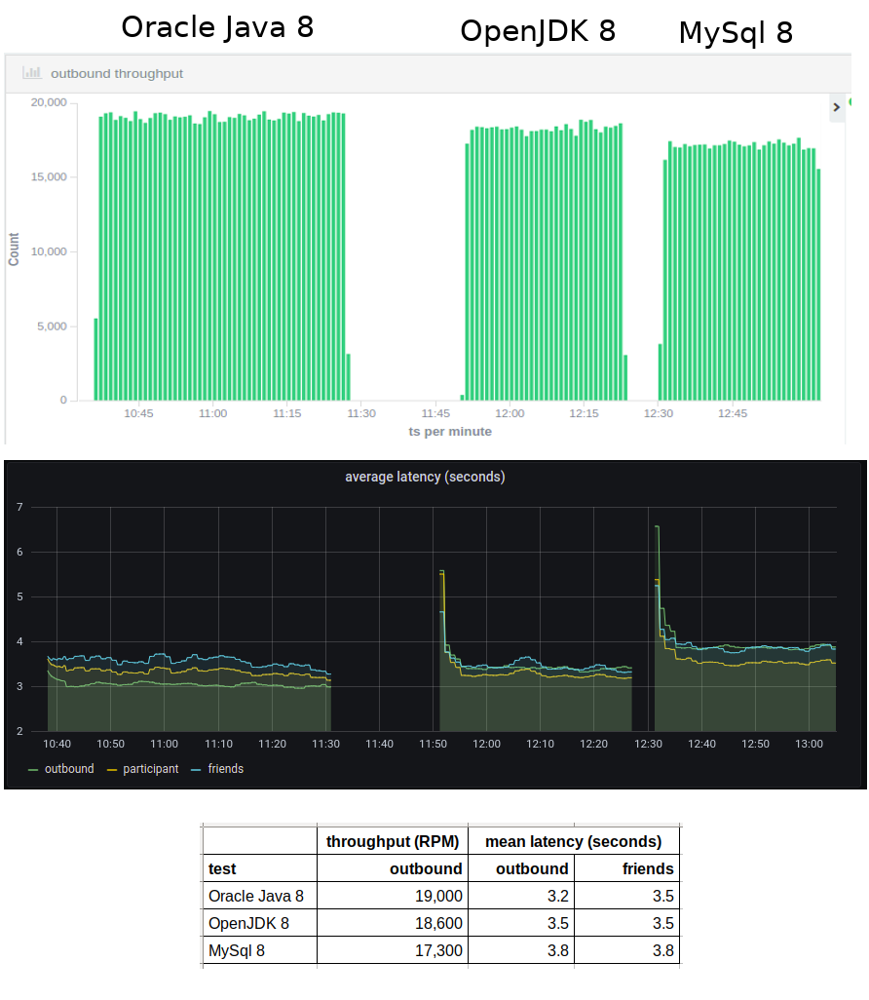

# newsfeed-dropwizard

This Java 8 project implements a rudimentary news feed micro-service using [Swagger](http://swagger.io/) and [DropWizard](http://www.dropwizard.io/1.0.5/docs/).

See this [article](https://glennengstrand.info/software/performance/clojure/dropwizard) which compares this Dropwizard based service with a feature similar service written in Clojure. See this [article](https://glennengstrand.info/software/performance/nodejs/dropwizard) which compares this service with a feature identical service written in javascript and based on the Node.js framework. See this [article](https://glennengstrand.info/software/performance/springboot/dropwizard) which compares this service to a feature identical service based on the Spring Boot framework. All of these articles provide more insight into both the internals and load driven performance behavior of this service.

## Deving on Kubernetes

Build the uberjar

```bash
mvn package
```

Build the docker image

```bash
cp target/newsfeed-swagger-1.0.0-SNAPSHOT.jar etc
cd etc
docker build -t feed3:1.0 .
```

See the [manifest](https://github.com/gengstrand/clojure-news-feed/blob/master/server/k8s/feed3-deployment.yaml) for how to deploy this docker image.

## Performance Under Load

Using the [load test](https://github.com/gengstrand/clojure-news-feed/tree/master/client/load) application, this microservice exhibited a throughput of 18,907 outbound post RPM with an average latency of 4 ms, a 95th percentile of 6 ms, and a 99th percentile of 10 ms. It had allocated about 1.7 GB RAM.

### January 2021 update

I needed to make some recent changes to this service so I ran the load test for both before and after each change. First, I re-ran the load test for the current version just to get an up-to-date baseline. Then I switched from Oracle Java 8 to OpenJDK 8 then ran the load test again. I found a 3% decrease in throughput and a 1% increase in latency. I noticed that the memory footprint dropped by two thirds so I suspect that I could compenstate for the slight degradation in performance by adjusting the heap settings. After that, I switched from version 5 of the MySql client to version 8 then ran the load test once more. This time, I found a 7% decrease in throughput and a 8% increase in latency. This change was triggered by a [dependabot](https://docs.github.com/en/github/managing-security-vulnerabilities/configuring-dependabot-security-updates) PR citing security reasons.



## newsfeed-swagger

The rest of these docs are swagger generated and cover how to call the micro-service.

See this legacy [setup topic](docs/setup.md) for tips on how to stand up the service pre Kubernetes.

### Documentation for API Endpoints

Class | Method | HTTP request | Description
------------ | ------------- | ------------- | -------------
*FriendApi* | [**addFriend**](docs/FriendApi.md#addFriend) | **POST** /friends/new | create a new friendship
*FriendApi* | [**getFriend**](docs/FriendApi.md#getFriend) | **GET** /friends/{id} | retrieve the list of friends for an individual participant
*InboundApi* | [**getInbound**](docs/InboundApi.md#getInbound) | **GET** /inbound/{id} | retrieve the inbound feed for an individual participant
*OutboundApi* | [**addOutbound**](docs/OutboundApi.md#addOutbound) | **POST** /outbound/new | create a participant news item
*OutboundApi* | [**getOutbound**](docs/OutboundApi.md#getOutbound) | **GET** /outbound/{id} | retrieve the news posted by an individual participant
*OutboundApi* | [**searchOutbound**](docs/OutboundApi.md#searchOutbound) | **POST** /outbound/search | create a participant news item
*ParticipantApi* | [**addParticipant**](docs/ParticipantApi.md#addParticipant) | **POST** /participant/new | create a new participant
*ParticipantApi* | [**getParticipant**](docs/ParticipantApi.md#getParticipant) | **GET** /participant/{id} | retrieve an individual participant


### Documentation for Models

 - [Friend](docs/Friend.md)
 - [Inbound](docs/Inbound.md)
 - [Outbound](docs/Outbound.md)
 - [Participant](docs/Participant.md)


