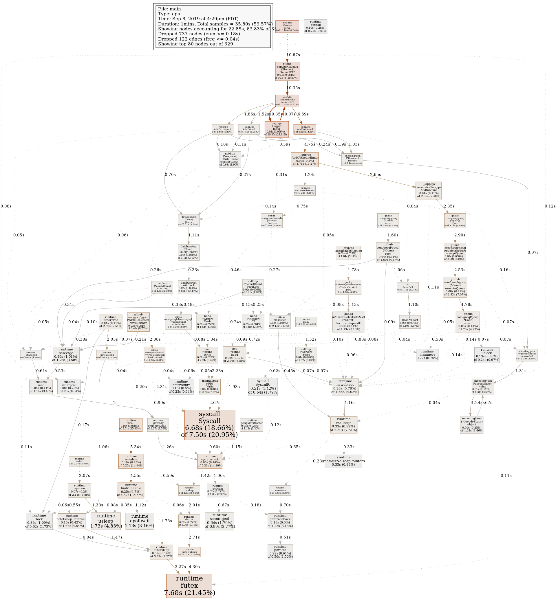

# Go API Server for newsfeed

## Overview

This folder contains a golang implementation of the news feed microservice. I used this code as the basis for my evaluation of Go as documented in this blog about [Writing Microservices in Go](http://glennengstrand.info/software/architecture/microservice/golang).

I started by using the [go-server template](https://github.com/swagger-api/swagger-codegen/tree/master/modules/swagger-codegen/src/main/resources/go-server) from the [swagger-codegen](https://github.com/swagger-api/swagger-codegen) project.

## Dependencies

I used the following projects.

The go-server templates use [mux](https://github.com/gorilla/mux) as the request dispatcher.

Access to the feed MySql DB was via the standard golang [SQL API](https://golang.org/pkg/database/sql/) to this [MySql driver](https://github.com/go-sql-driver/mysql/).

The Redis cache was used to front access to the MySql DB with this [Redis client library](https://github.com/go-redis/redis).

I used the standard [Cassandra client library](https://github.com/gocql/gocql) for inbound and outbound entities.

I used this non-standard [Elasticsearch client library](https://olivere.github.io/elastic/) because it still supports version 2.

## Usage

You will need to install the dependencies.

```
 go get -u github.com/gorilla/mux
 go get -u github.com/go-sql-driver/mysql
 go get -u github.com/go-redis/redis
 go get -u github.com/gocql/gocql
 go get -u github.com/google/uuid
 go get -u gopkg.in/olivere/elastic.v3
```

Here is how to run the sample unit test

```
go test test/api_outbound_test.go
```

Here is how to build the docker image.

```
docker build -t feed9:1.0 .
```

Here is how to deploy the docker image.

```
cd ../k8s
kubectl create -f feed9-deployment.yaml
```

## Load Testing

I tested this microservice using the standard load test environment for two hours (see the client/load folder in this repo). The average per minute throughput of output posts was 18,425 with an average duration of 5 ms, a median of 4 ms, and a 99th percentile of 29 ms.

Here is a CPU profile of the service when testing it locally with a scaled down version of the load test.



