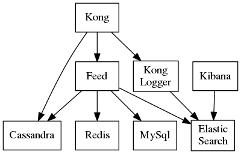

# running on Kubernetes

Introduction on how to run the news feed service in Kubernetes.



## minikube

For developer purposes, I am using [minikube](https://github.com/kubernetes/minikube) on a Linux laptop. The commands to start up minikube may be different for you.

```shell
minikube start --vm-driver=kvm2
eval $(minikube docker-env)
```
If you get an error like this...

Requested operation is not valid: network 'minikube-net' is not active

...then try this...

```shell
virsh
net-start minikube-net
```

### setting up the dependencies

I have written some scripts and configuration files to get the dependent services running. 

#### starting up the cluster

The setup script should work on any Kubernetes cluster. Alternatively, you can provide a use_cluster_ip parameter if you do not want to use the kube-dns cabality. You have to run this scipt only once (unless you delete services and deployments). 

```shell
cd clojure-news-feed/server/k8s
./setup.sh
```

#### initializing the dependent services

You have two alternatives here. You can either run a kubernetes job or a minikube specific script. Here is the kubernetes job. You need to perform this step every time you start up minikube.

```shell
kubectl create -f init-cluster.yaml
```

Here is the minikube specific script approach. You will need to have installed minikube, kubectl, mysql and cqlsh and that they are available in your $PATH environment. You may need to wait a few minutes after starting minikube before you run that initMinikube.sh script.

```shell
./initMinikube.sh
```

### building the service

The existing deployment manifests load prebuilt images from my dockerhub account but you can edit those locally to use your own builds. Build a docker image for the feed service that you wish to deploy. Here is how to do that for the node.js (feed4) version. See the README information in the project folder for instructions on how to do that.

```shell
cd ../feed4
docker build -t feed4:1.0 .
```

### running the service

Note that the feed-deployment.yaml file gets overwritten by the setup.sh script and deploys what we just built. The feed-deployment.yaml file deploys feed4. There are other feed deployment manifests in this folder for deploying any version of the feed service that you are interested in but you have to edit them if you want to run what you built locally.

```shell
cd ../k8s
kubectl create -f configmap.yaml
kubectl create -f feed-service.yaml
kubectl create -f feed-deployment.yaml
```
### testing the service

This is also minikube specific.

```shell
FEED_URL=$(minikube service feed --url)

curl -H "Content-Type: application/json" -d '{"name":"testing dropwizard"}' ${FEED_URL}/participant/new

curl -H "Content-Type: application/json" -d '{"name":"testing minikube"}' ${FEED_URL}/participant/new

curl -H "Content-Type: application/json" -d '{"from":1,"to":2}' ${FEED_URL}/friends/new

curl -H "Content-Type: application/json" -d '{"from":1,"subject":"testing for dropwizard","story":"Kubernetes rocks!"}' ${FEED_URL}/outbound/new

curl ${FEED_URL}/inbound/2

curl -X POST -g "${FEED_URL}/outbound/search?keywords=kubernetes"
```

Alternatively, you can also run the testMinikube.sh to perform the automated version of this test. This script runs the load test app in integration test mode so you will need to have built what is in the client/load project.

### Optional Kong Integration

While it is not neccessary to use the open source API Gateway software [Kong](https://getkong.org), it can be very helpful especially if you want to measure performance without Kafka. 

#### Build the Kong-Logger service and the load test job

Currently, the deployment configurations point to these images on my [Docker Hub account](https://hub.docker.com/r/gengstrand) so you don't really need to build these locally. If you wanted to modify what these do, then you will need to build the images and modify the deployment configurations to reference the local docker repository.

```shell
cd clojure-news-feed/client/perf4
mvn package
docker build -t kong-logger:1.0 .
cd ../load
lein uberjar
docker build -t load:1.0 .
```

#### Launch Kong, Kong Logger, and the load test job

```shell
cd clojure-news-feed/server/k8s
kubectl create -f kong-logger-service.yaml
kubectl create -f kong_service.yaml
kubectl create -f kong_migration_cassandra.yaml
# run this next line until the kong-migration job is successful
kubectl get jobs
kubectl create -f kong_cassandra.yaml
kubectl create -f kong-logger-deployment.yaml
kubectl create -f load_test.yaml 
```

Be advised that, if you are testing feed 1 or 2, then you should use the load_test_legacy.yaml instead of the load_test.yaml manifest. After that, you should be able to reach the feed service via Kong this way.

```shell
FEED_URL=$(minikube service kong-proxy --url | head -n 1)
```

Be advised that, after running the load test, my minikube cluster is pretty much maxed out. I actually have to delete the load test job before launching kibana.

#### Launch Kibana

```shell
kubectl create -f kibana-service.yaml 
kubectl create -f kibana-deployment.yaml
```

If you call the news feed APIs with the kong-proxy URL, then you will be able to track performance by pointing your web browser to the kibana-logger URL.

## Kubernetes in the Cloud

Once you have everything working the way you want on your personal computer, you will most likely want to see how to deploy it to the cloud. Here is a blog on the differences between running Kubernetes on Amazon's and on Google's cloud.

http://glennengstrand.info/software/performance/eks/gke

Here are some tips on how to do that on both GKE and EKS.

### Google Kubernetes Engine

I created a project called feed and a cluster called feed-test using 7 n1-standard-4 instances through Kubernetes Engine part of the the Google Cloud Platform dashboard. Then I ran the following in the gcloud console.

```
gcloud config set project feed-193503
gcloud config set compute/zone us-central1-a
gcloud container clusters get-credentials feed-test --zone us-central1-a --project feed-193503
git clone https://github.com/gengstrand/clojure-news-feed.git
cd clojure-news-feed/server/k8s
```

### Amazon Elastic Container Service for Kubernetes

It is not as easy to provision a Kubernetes cluster on EKS as it is on GKE. If you are new to EKS, then it will take hours to make it through this [getting started](https://docs.aws.amazon.com/eks/latest/userguide/getting-started.html) topic but that is what you are going to have to do. Read that long and detailed topic very carefully and be prepared to follow it to the letter. There are plenty of gotchas here and you need to be very familiar with IAM, CloudFormation, EKS, AWS CLI, and the AWS IAM Authenticator for Kubernetes. You will need to use both the AWS Console and CLI. Some things that they list as optional are actually mandatory.

* Create the EKS Service Role
* Ensure that you have IAM user credentials (with AWS_ACCESS_KEY_ID and AWS_SECRET_ACCESS_KEY) that is allowed to sts:AssumeRole with the EKS Service Role.
* Create the EKS Cluster VPC
* Install the latest AWS CLI with the IAM user credentials above
* You should create the EKS cluster via the command line.

```
aws eks create-cluster --name devel --role-arn arn:aws:iam::111122223333:role/eks-service-role-AWSServiceRoleForAmazonEKS-EXAMPLEBKZRQR --resources-vpc-config subnetIds=subnet-a9189fe2,subnet-50432629,securityGroupIds=sg-f5c54184
aws eks describe-cluster --name devel --query cluster.status
aws eks describe-cluster --name devel  --query cluster.endpoint --output text
aws eks describe-cluster --name devel  --query cluster.certificateAuthority.data --output text
```

* Install and Configure kubectl for EKS
* Install aws-iam-authenticator for EKS
* Launch and configure EKS Worker Nodes. I used 7 m4.xlarge instances.
* Enable those worker nodes to join the cluster

```
curl -O https://amazon-eks.s3-us-west-2.amazonaws.com/cloudformation/2018-08-30/aws-auth-cm.yaml
# edit that file as documented
kubectl apply -f aws-auth-cm.yaml
```

### Spinning up the Services

Once you have provisioned your cluster on the Public Cloud vendor of choice, you can proceed with the cloud vendor neutral Kubernetes commands. 

```
kubectl create -f cassandra-service.yaml
kubectl create -f redis-service.yaml
kubectl create -f mysql-service.yaml
kubectl create -f elasticsearch-service.yaml
kubectl create -f cassandra-deployment.yaml
kubectl create -f redis-deployment.yaml
kubectl create -f mysql-deployment.yaml
kubectl create -f elasticsearch-deployment.yaml
# run this next line until all of the pods are running
kubectl get pods
kubectl create -f init-cluster.yaml
# run this next line until the init-cluster job is successful
kubectl get jobs
kubectl create -f configmap.yaml
kubectl create -f feed-service.yaml
kubectl create -f feed-deployment.yaml
kubectl create -f kong-logger-service.yaml
kubectl create -f kong_service.yaml
kubectl create -f kong_migration_cassandra.yaml
# run this next line until the kong-migration job is successful
kubectl get jobs
kubectl create -f kong_cassandra.yaml
kubectl create -f kong-logger-deployment.yaml
kubectl create -f kibana-service.yaml 
kubectl create -f kibana-deployment.yaml
kubectl create -f load_test.yaml
```

Once I collected the data, I cleaned up everything before deleting the cluster.

```
kubectl delete job init-cluster
kubectl delete job kong-migration
kubectl delete job load-test
kubectl delete deployment kibana-logger
kubectl delete deployment kong-logger
kubectl delete deployment kong-proxy
kubectl delete deployment feed
kubectl delete deployment elasticsearch
kubectl delete deployment redis
kubectl delete deployment mysql
kubectl delete deployment cassandra
kubectl delete service cassandra
kubectl delete service elasticsearch
kubectl delete service feed
kubectl delete service kibana-logger
kubectl delete service kong-logger
kubectl delete service kong-proxy
kubectl delete service mysql
kubectl delete service redis
```